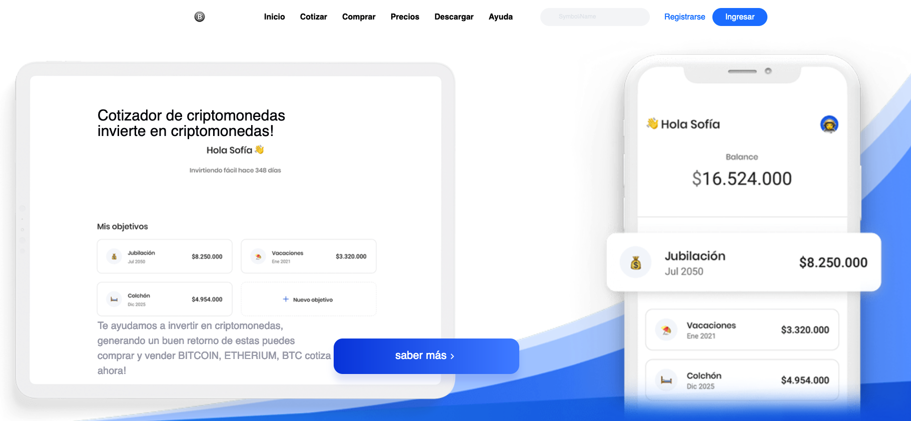

  <a href="https://criptomonedas-concepto.netlify.app" target="_blank">
    <h1>CRIPTOMONEDAS</h1>
  </a>

### :heart: ¿Te gusto este proyecto?
Si te gusto este proyecto comparte y dale una estrella :star: en Github y no dudes en contactarme.

[**CRIPTOMONEDAS**]Si quieres ver el api de cotización puedes ir al siguiente link <a href="https://www.cryptocompare.com/" target="_blank">https://www.cryptocompare.com/</a>

### Este repositorio es un experimento con stylecomponent y la api de comparación de criptomonedas :heart:.

## Mi canal de youtube 

[Youtube](https://www.youtube.com/channel/UCQsrs_h91Q-baLx-n_rcdNg)

## Mis articulos en medium
[medium](https://devjaime.medium.com/)

## Mi twitter por si quieres contacterme
[medium](https://twitter.com/HsJhernandez)

